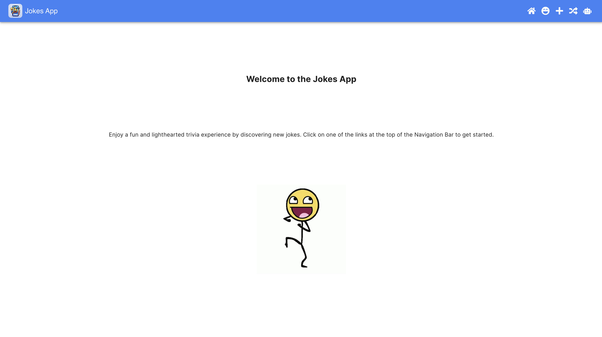
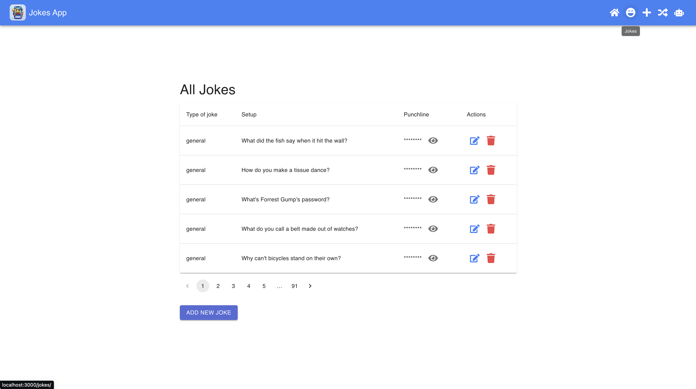
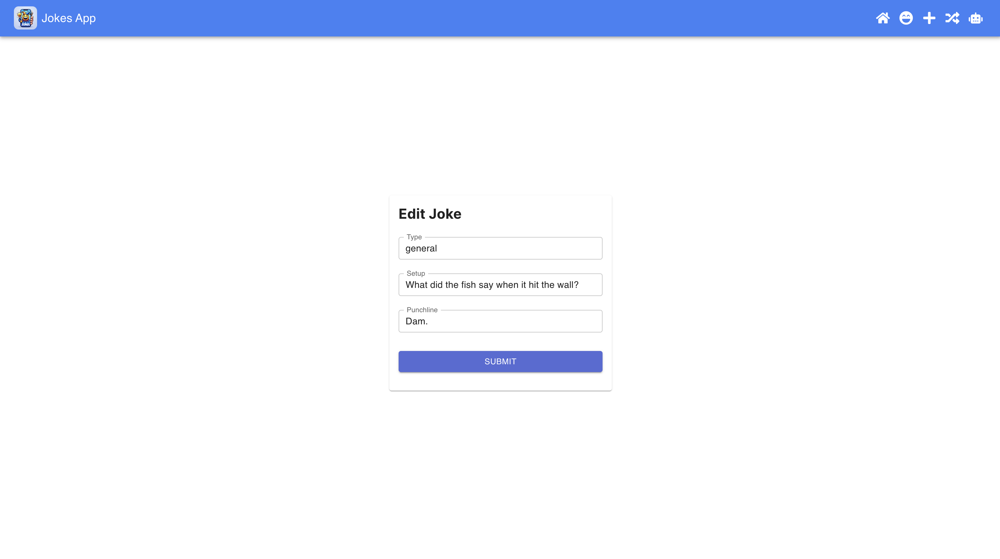
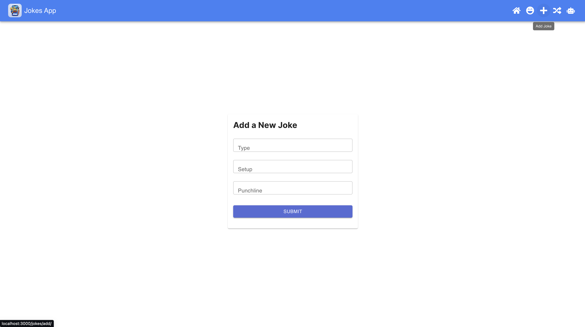
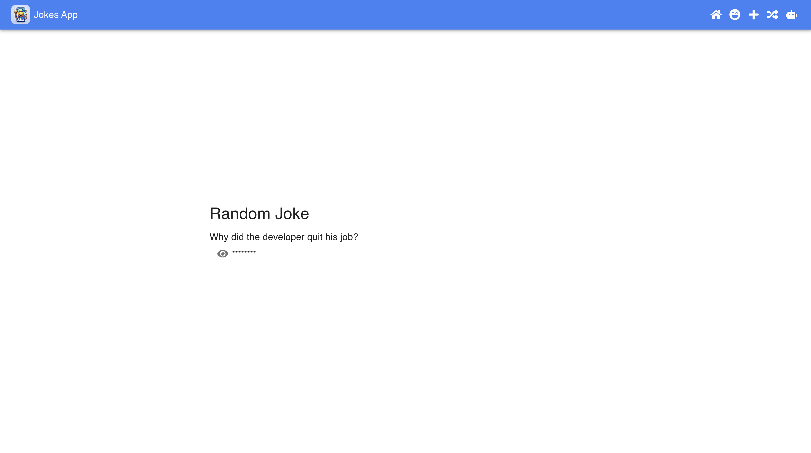
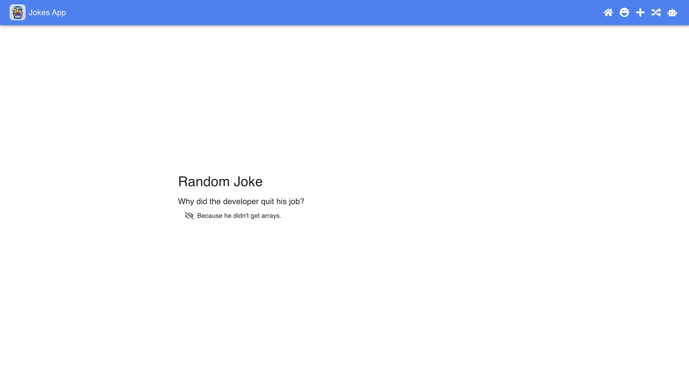
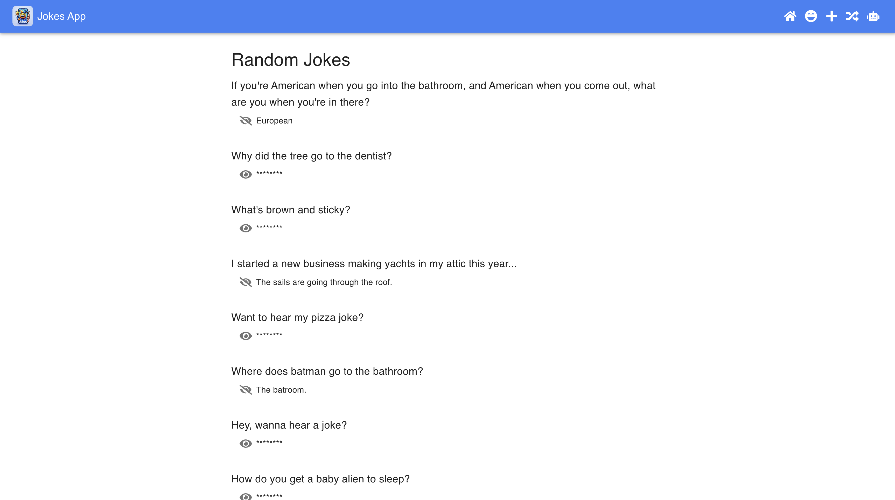
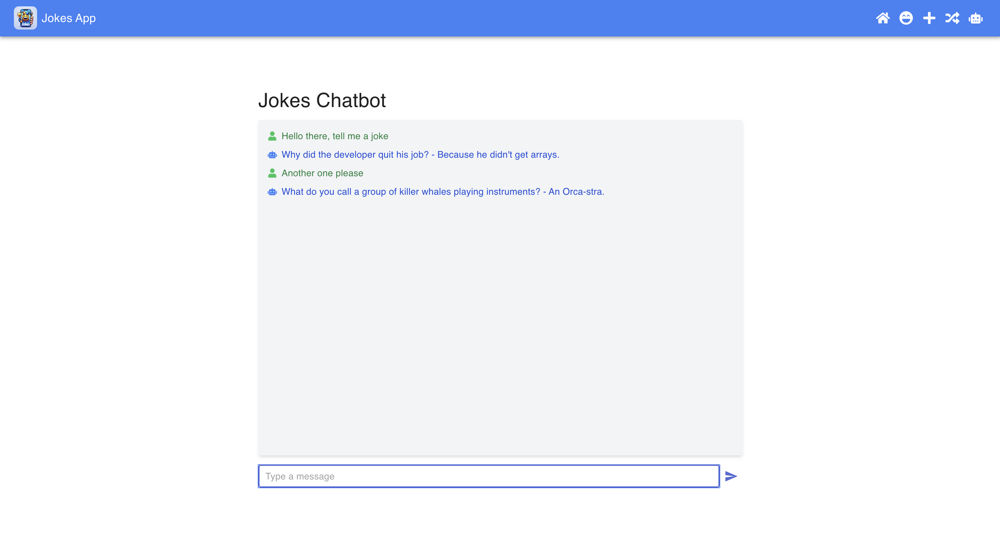
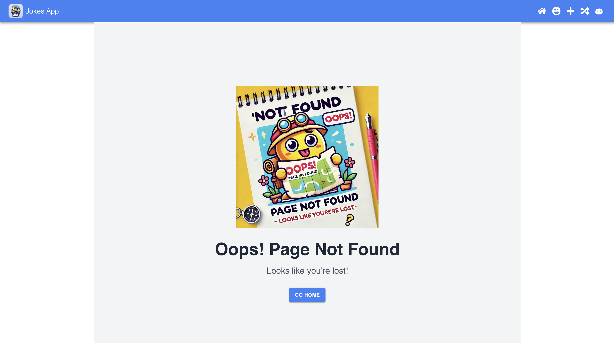

# Jokes App

Welcome to Jokes App! This is a fun and interactive platform where you can share, view, and react to jokes.

## Table of Contents

- [Jokes App](#jokes-app)
  - [Table of Contents](#table-of-contents)
  - [Features](#features)
  - [Requirements](#requirements)
  - [Setup](#setup)
  - [Running the App](#running-the-app)
  - [Building the App](#building-the-app)
  - [Linting](#linting)
  - [Formatting](#formatting)
  - [Testing](#testing)
  - [Database Migration and Seeding](#database-migration-and-seeding)
  - [Clearing Cache](#clearing-cache)
  - [Project Structure](#project-structure)
  - [Screenshots](#screenshots)
    - [Home Page](#home-page)
    - [Jokes List](#jokes-list)
    - [Edit Joke](#edit-joke)
    - [Add New Joke](#add-new-joke)
    - [Random Joke](#random-joke)
    - [Random Joke by number](#random-joke-by-number)
    - [Jokes Chatbot](#jokes-chatbot)
    - [Page Not Found](#page-not-found)
  - [Improvements and Future Features](#improvements-and-future-features)
    - [Improvements](#improvements)
    - [Cool Features to Add](#cool-features-to-add)
  - [License](#license)
  - [Q\&A](#qa)

## Features

- jokes table with pagination
- View random jokes
- React to jokes
- Interactive chatbot for jokes
- User-friendly interface with smooth animations
- Error boundaries and custom snackbar for user feedback
- Loading animations and skeleton screens

## Requirements

- Node.js >= 20
- pnpm >= 9.6.0
- Docker
- Redis

## Setup

1. Clone the repository:
    ```bash
    git clone https://github.com/AngelProjects/jokes-app.git
    cd jokes-app
    ```

2. Install dependencies:
    ```bash
    pnpm install
    ```

3. Set up the environment variables:
    ```bash
    DATABASE_URL=
    REDIS_URL=
    ```

4. Start the Docker containers:
    ```bash
    pnpm docker:up
    ```

## Running the App

To run the app in development mode:
```bash
pnpm dev
```

## Building the App

To build the app for production:
```bash
pnpm build
```

## Linting

To lint the code:
```bash
pnpm lint
```

To fix linting issues:
```bash
pnpm lint:fix
```

## Formatting

To format the code:
```bash
pnpm format
```

## Testing

To run unit tests:
```bash
pnpm test
```

To run end-to-end tests:
```bash
pnpm test:e2e
```

*Note: Currently, unit tests and end-to-end tests are not fully implemented.*

## Database Migration and Seeding

To migrate the database schema:
```bash
pnpm migrate
```

To seed the database with initial data:
```bash
pnpm seed
```

## Clearing Cache

To clear the Redis cache:
```bash
pnpm clear:redis
```

## Project Structure

```
.
├── prisma
│   ├── schema.prisma
│   └── seed.ts
├── public
│   └── images
│       ├── dancing.gif
│       ├── loading.gif
│       ├── logo.webp
│       ├── not-found.webp
│       └── wrong.webp
├── src
│   ├── app
│   │   ├── api
│   │   │   ├── jokes
│   │   │   │   ├── [id]
│   │   │   │   │   └── route.ts
│   │   │   │   ├── random
│   │   │   │   │   ├── [number]
│   │   │   │   │   │   └── route.ts
│   │   │   │   │   └── route.ts
│   │   │   │   └── route.ts
│   │   ├── jokes
│   │   │   ├── add
│   │   │   │   └── page.tsx
│   │   │   ├── chatbot
│   │   │   │   └── page.tsx
│   │   │   ├── edit
│   │   │   │   └── [id]
│   │   │   │       └── page.tsx
│   │   │   ├── random
│   │   │   │   ├── [number]
│   │   │   │   │   └── page.tsx
│   │   │   │   └── page.tsx
│   │   │   ├── layout.tsx
│   │   │   └── page.tsx
│   │   ├── layout.tsx
│   │   ├── loading.tsx
│   │   ├── not-found.tsx
│   │   └── page.tsx
│   ├── components
│   │   ├── joke
│   │   │   ├── JokeForm.tsx
│   │   │   └── JokeList.tsx
│   │   ├── layout
│   │   │   ├── CustomSnackbar.tsx
│   │   │   ├── ErrorBoundary.tsx
│   │   │   ├── LoadingAnim.tsx
│   │   │   └── Navbar.tsx
│   ├── lib
│   │   ├── prisma.ts
│   │   └── redis.ts
│   ├── providers
│   │   ├── StoreProvider.tsx
│   │   ├── ThemeProviderClient.tsx
│   │   └── theme.ts
│   ├── store
│   │   ├── hooks.ts
│   │   ├── index.ts
│   │   ├── reducers.ts
│   │   ├── slices
│   │   │   ├── apiSlice.ts
│   │   │   └── snackbarSlice.ts
│   │   └── types.ts
│   ├── styles
│   │   └── global.scss
│   └── types
│       ├── api.ts
│       ├── chatbot.ts
│       └── joke.ts
├── scripts
│   └── clear-cache.ts
├── .dockerignore
├── .editorconfig
├── .env
├── .eslintrc.json
├── .gitignore
├── .lintstagedrc.js
├── .nvmrc
├── .npmrc
├── .prettierrc
├── .snyk
├── .stylelintrc
├── .vscode
│   ├── settings.json
│   └── extensions.json
├── docker-compose.yml
├── jest.config.js
├── next.config.mjs
├── package.json
├── pnpm-lock.yaml
├── postcss.config.mjs
├── tailwind.config.js
├── tsconfig.json
└── README.md
```

## Screenshots

### Home Page


### Jokes List


### Edit Joke


### Add New Joke


### Random Joke



### Random Joke by number


### Jokes Chatbot


### Page Not Found


## Improvements and Future Features

### Improvements
- Implement comprehensive unit tests and end-to-end tests.
- Improve error handling and user feedback mechanisms.
- Optimize the database queries and caching strategies.

### Cool Features to Add
- **User Authentication:** Allow users to create accounts, log in, and save their favorite jokes.
- **Joke Categories:** Organize jokes into different categories and allow users to filter jokes by category.
- **Social Sharing:** Add functionality to share jokes on social media platforms.
- **Joke Rating:** Allow users to rate jokes and display the highest-rated jokes.
- **Dark Mode:** Add a dark mode option for better user experience in low-light environments.
- **Internationalization:** Support multiple languages for a wider audience.
- **Notifications:** Send push notifications for new jokes or updates.

## License

This project is licensed under the MIT License.

## Q&A

1. **What's a closure? Where in the code is there a closure?**

   A closure is a function that retains access to its lexical scope, even when the function is executed outside that scope. In JavaScript, closures are created every time a function is created. In our code, closures can be found in several places. For example, in `JokeList.tsx`:
   ```javascript
   const handleTogglePunchline = (id: number) => {
     setVisiblePunchlines(prev => ({ ...prev, [id]: !prev[id] }));
   };
   ```
   Here, `handleTogglePunchline` is a closure that has access to the `id` parameter and the `visiblePunchlines` state variable.

2. **Which are the potential side-effects in any function? Could you point out any of these cases in your code? Are they expected? Can they be avoided?**

    Side effects in functions are operations that affect the state outside the function scope or interact with the outside world (e.g., modifying a global variable, performing I/O operations). Potential side-effects in our code include:

    - Database operations in API routes like `route.ts` for creating, updating, or deleting jokes.
    - State updates in React components like `JokeList.tsx` where `setVisiblePunchlines` updates the component state.
    - Cache clearing in `clear-cache.ts`.
  These side-effects are expected in our application as they are essential for its functionality. However, we can manage them better by ensuring our functions are as pure as possible and by using tools like Redux for state management to handle state changes in a more predictable way.
